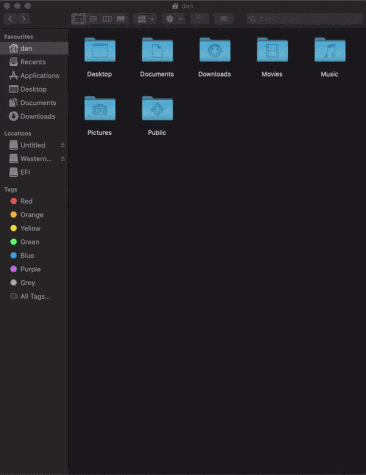

# AirPlonk &nbsp;[](https://twitter.com/intent/tweet?text=Just%20AirPlonk%20it.%20&url=https://github.com/daaanstraight/AirPlonk&via=daaanstraight&hashtags=bash,shell,rsync,ssh,developers)


[](https://github.com/daaanstraight/AirPlonk/LICENSE)

Uses [nmap] and [rsync] to quickly identify nodes and push files to them over port 22.


## Getting Started

### Prerequisites

A [bash](https://github.com/topics/bash) environment, that's all. 

On Linux, macOS and Termux this is available by default.

Windows will require a seperate [installation](https://itsfoss.com/install-bash-on-windows/).

### Installing

#### Debian (Mint, Ubuntu, Kali ...)
Download this [.deb package](https://github.com/gomesdigital/AirPlonk/raw/main/airplonk_1.0.0_all.deb), then in the enclosing directory:
```
sudo dpkg -i airplonk_1.0.0_all.deb
```

#### Homebrew
```
brew tap daaanstraight/airplonk
brew install airplonk
```

#### macOS
```
git clone https://github.com/daaanstraight/AirPlonk
cd AirPlonk
./install_macOS.sh
```
The 'install_macos.sh' script will take care of putting files where they need to 
be, but you'll need to install the project dependencies on your own. AirPlonk 
will however list these for you if it detects any.
(I recommend installing [Homebrew](https://www.howtogeek.com/211541/homebrew-for-os-x-easily-installs-desktop-apps-and-terminal-utilities/) and using the instructions that are mentioned for it instead.)

#### Android-Termux 
```
git clone https://github.com/gomesdigital/AirPlonk
cd AirPlonk
./install_termux.sh
```
The 'install_termux.sh' script will take care of installing the necessary 
dependencies.<br/>
Note: Try 'bash airplonk' to run if you don't have root permission.

#### Windows & Otherwise
Clone this project. The 'airplonk' file contains all the logic and the man
page is called 'airplonk.1' - move them where you need them.

#### After installing
Run
```
airplonk
```
to start.

## Demo
AirPlonk pushes your current working directory to the target node of your choosing.

In this example: pushing files from android to macOS.

 &nbsp;&nbsp;  

## Help

To see the manual, run
```
man airplonk
```
or try
```
airplonk -h
```


Can't find any nodes...? Run
```
airplonk -t
```
to troubleshoot.

## Contributing

Please read the [CONTRIBUTING](CONTRIBUTING.md) file for details on our code of conduct, and the process for submitting pull requests to us.

## License

This project is licensed under the GNU General Public License v3.0. See the [LICENSE](LICENSE) file for details.

## Author Info

* **Daniel Gomes-Sebastiao** - *Initial work* - [gomesdigital](https://github.com/gomesdigital)

See also the list of [contributors](https://github.com/gomesdigital/AirPlonk/graphs/contributors) who participated in this project.

## Acknowledgements

After returning from a short road trip I wanted to dump some media from my android onto my desktop...

Problem: 
1. At the time my Hackintosh didn't have a configured bluetooth module. (And I wasn't even going to bother with Android File Transfer.)
2. The files I was after were quite large. I wanted them now and I wasn't about to send them off to some server in Iceland just to re-download
   them to the same room. They were right here.

My girlfriend said - "Just AirDrop it."

And so, AirPlonk was born - a somewhat OS-agnostic solution for exactly this. 

Amongst this I have quite a few headless devices, and it's become quite cumbersome to keep track of their hostnames/ip's for when I want to shoot something over to them. AirPlonk has been serving this well.

Enjoy.

[nmap]: https://github.com/nmap/nmap
[rsync]: https://github.com/WayneD/rsync
